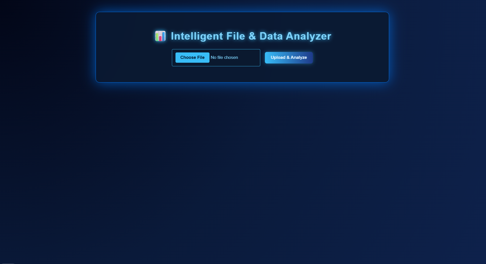
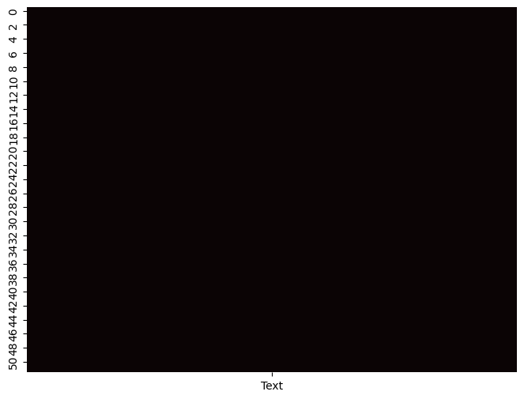

# ⚡ File Data Analyzer

> 🚀 A smart Flask-based web app that analyzes uploaded files (Excel, PDF, and Text) — generating instant summaries, insights, and missing value heatmaps in a clean cyber-style dashboard.

---

## 🧠 Overview

This project is designed to **analyze structured and unstructured data files** with a modern UI inspired by **cybersecurity dashboards**.  
Upload any file — whether it's a spreadsheet, a report, or a text log — and get:
- Automated content summaries 🧾  
- Data insights and missing value detection 📊  
- PDF report generation 📄  
- A dark navy cyber-themed user interface 💻  

---

## 🏗️ Tech Stack

| Layer | Technology |
|:------|:------------|
| **Frontend** | HTML5, CSS3 (Cyber Navy Theme), Jinja2 |
| **Backend** | Python (Flask Framework) |
| **Data Processing** | Pandas, Matplotlib, Seaborn |
| **File Handling** | PyPDF2, OpenPyXL |
| **Reporting** | ReportLab |
| **Visualization** | Dynamic Heatmaps (Matplotlib + Seaborn) |

---

## ⚙️ Features

✅ Upload **Excel**, **PDF**, or **Text** files  
✅ Auto-generate **DataFrame summaries** (rows, columns, missing values)  
✅ Visualize missing values via **heatmaps**  
✅ Export auto-generated **PDF reports**  
✅ Modern ** cyber-style UI** with glowing text and animations  
✅ Lightweight and beginner-friendly Flask setup  

---

## 📸 Screenshots

| Dashboard | Heatmap |
|:-----------:|:-----------:|
|  |  |


---

## 🚀 Getting Started

### 1️⃣ Clone the Repo
```bash
git clone https://github.com/<your-username>/flask-file-analyzer.git
cd flask-file-analyzer
pip install -r requirements.txt
python app.py
http://127.0.0.1:5000/
```

---

🗂️ Project Structure
file_data_analyzer/
│── app.py
│── analyzer.py
│── requirements.txt
│── templates/
│   └── index.html
│── static/
│   ├── images/
│   │   └── cyber-bg.jpg
│   └── plot.png
│── uploads/
│── README.md
│── .gitignore

---

This project is released under the MIT License — free for educational and professional use.
